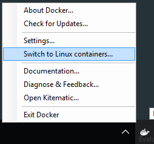
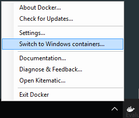

# HPE Discover Kiosk Demo

## Demo setup

Ensure the laptop has Docker for Mac or Docker for Windows (Beta channel) installed.


## Docker Linux Containers Demo:

1. **On Docker for Windows** - ensure we're in Linux container mode from the taskbar:



2. To launch the container type the following command in the terminal window

   `docker run --name hpediscover -d -p 8080:80 sixeyed/kiosk-tweet:alpine`

3. Switch to a web browser and navigate to: `http://localhost:8080`

4. Click Tweet button and follow the directions (don't worry, we don't save the Tweet credentials, since we'll destroy the container in the next step)

5. Switch back to the terminal and execute the following to commands to stop the container, and then remove it.  

    ```
    $ docker stop hpediscover
    $ docker rm hpediscover
    ```


## Docker Windows Containers Demo (Docker for Windows only):

1. Ensure we're in Windows container mode from the taskbar:



2. To launch the container type the following command in the PowerShell window

   `docker run --name hpediscover -d -p 8080:80 sixeyed/kiosk-tweet:windowsservercore`

3. Get the IP address of the container and launch the browser:

    ```
    $ip = docker inspect --format '{{ .NetworkSettings.Networks.nat.IPAddress }}' hpediscover
    start "http://$($ip)"  
    ```

4. Click Tweet button and follow the directions (don't worry, we don't save the Tweet credentials, since we'll destroy the container in the next step)

5. Switch back to the terminal and execute the following to commands to stop the container, and then remove it.  

    ```
    $ docker stop hpediscover
    $ docker rm hpediscover
    ```
